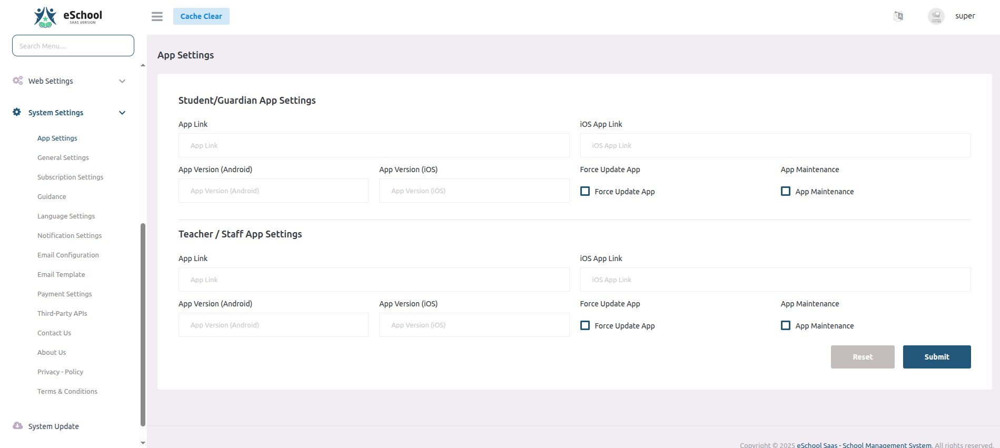
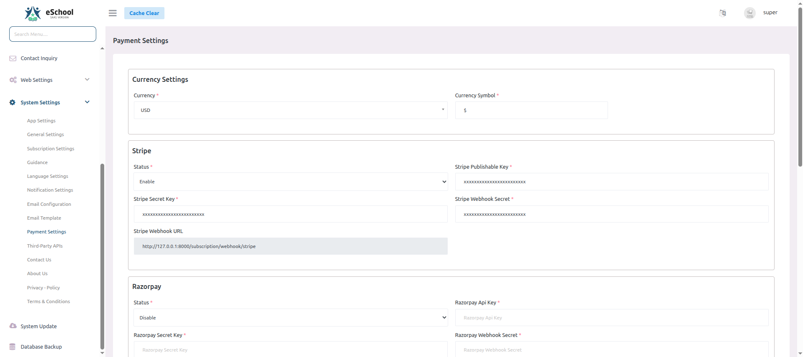
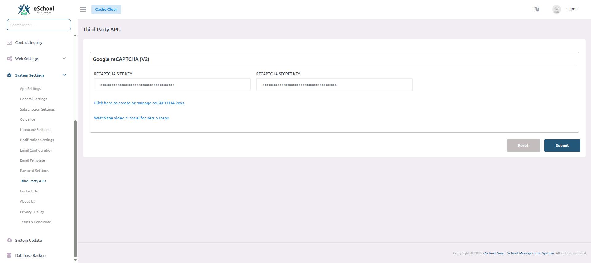

# Additional Configurations

After Installation you need to setup some settings before using the system.

## 1. Session Year

Set your Current & upcoming session years here, So you can manage students by session year.

## 2. App Settings

This settings will be used by your Flutter APP.

## 3. General Settings

This settings will be used by Admin Panel. You can set your current session year here.

## 4. FCM Settings

Need to enter Firebase project id and Firebase service file.

You can get firebase project id and service file as shown in the images.

## 5. Email Configurations

Send Email configurations so that system can send emails to registered users.

## 6. Fee payment Configurations

Stripe credentials. At a time only one payment gateway will be enable.

## 7. Payment Gateway's Webhook Configuration

### Webhook Configuration for Stripe

## 8. Google reCAPTCHA Configurations

Set the API keys as shown in the image. You can get the API keys from here [https://www.google.com/recaptcha/admin/create](https://www.google.com/recaptcha/admin/create)

