# ⚙️ Additional Configurations

After successful installation, configure these essential settings to ensure your e-School SaaS system functions optimally.

## 📋 Configuration Overview

Complete these configurations in order for the best setup experience:

1. 🏫 System Settings
2. 🌐 Language Settings 
3. 🔔 Notification Settings
4. 📧 Email Configuration
5. 💳 Payment Gateway Setup
6. 🔐 Security Settings
7. 📞 Contact Settings
8. 📝 About Us Settings
9. 🔒 Privacy Policy Settings
10. 📜 Terms & Conditions
11. 🔄 System Updates
12. 💾 Database Backup

---

## 1️⃣ System Settings (Super Admin)

### 🏫 Basic Information
- **📝 System Name** – App name displayed across the platform
- **📞 Mobile Number** – Contact number for support/display
- **🏷️ Tag Line** – Catchy phrase representing your school/app
- **📄 Description** – Brief description of platform features
- **📍 Address** – Full postal address of your institution

### ⏰ Time & Date Settings
- **🌍 Time Zone** – Set local timezone (e.g., Asia/Kolkata)
- **📅 Date Format** – Choose date display format (e.g., dd-mm-yyyy)
- **🕐 Time Format** – Choose time display format (e.g., hh:mm AM/PM)

### 🎨 Branding & Visual Settings
- **🔖 Favicon** – Small icon displayed in browser tab
- **🖼️ Horizontal Logo** – Main logo for header and topbar
- **📐 Vertical Logo** – Alternate logo for sidebar layouts
- **🔑 Login Page Logo** – Logo shown on login screen
- **🎨 Color Theme** – Primary UI color for branding

### 🔧 System Configuration
- **🏫 School Code Prefix** – Prefix for generating school codes (e.g., SCH)
- **🚧 Web Maintenance Mode** – Enable to temporarily restrict access
- **🔐 Two-Factor Verification** – Add extra login security
- **📁 File Upload Size Limit** – Maximum file upload size (in MB)
- **📝 School Inquiry Form** – Enable/Disable public school inquiry

---

## 2️⃣ App Settings

Configure settings that will be used by your Flutter mobile application.

---

## 3️⃣ Subscription Settings

Configure subscription and billing settings for your schools.

### ⚙️ General Settings
- **📅 Additional Billing Days** – 5 days grace period for payments
- **⚠️ Expiry Warning** – 7 days advance notice before plan expires
- **🔄 Cron Job URL** – `http://127.0.0.1:8000/subscription/cron-job`
  - Configure daily cron job to check subscriptions and generate bills

### 🎁 Free Trial Configuration  
- **⏰ Trial Duration** – Set number of trial days
- **👥 Student Limit** – Maximum students during trial
- **👨‍💼 Staff Limit** – Maximum staff during trial
- **📝 Description** – Trial plan details
- **✅ Status** – Active/Inactive
- **⭐ Highlight** – Featured trial package

### 📱 Available Features
| Core Features | Academic Features | Administrative Features |
|--------------|-------------------|------------------------|
| Student Management | Assignment Management | Staff Management |
| Teacher Management | Lesson Management | Expense Management |
| Staff Leave Management | Exam Management | Website Management |
| Fees Management | Attendance Management | Announcement Management |
| School Gallery Management | Timetable Management | Chat Module |
| ID Card & Certificate Generation | Academics Management | Holiday Management |
| Session Year Management | Slider Management | |

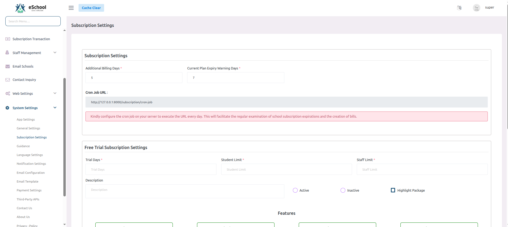

---

## 4️⃣ Manage Guidance

Configure guidance links and resources for your schools.

### ⚙️ Create Guidance
- **📝 Name** - Enter a descriptive name for the guidance resource
- **🔗 Link** - Provide the URL where the guidance content can be accessed

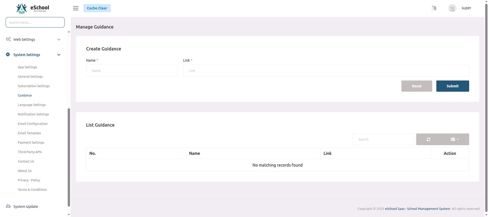

---

## 5️⃣ Language Settings

Configure language options for your schools.

### ⚙️ Language Configuration
- **📝 Language Name** - Enter the display name of the language (e.g., English, Spanish)
- **🔤 Language Code** - Specify the ISO language code (e.g., en, es)
- **📄 Language File** - Upload the language translation file
- **↔️ Is RTL** - Enable for right-to-left languages (e.g., Arabic, Hebrew)

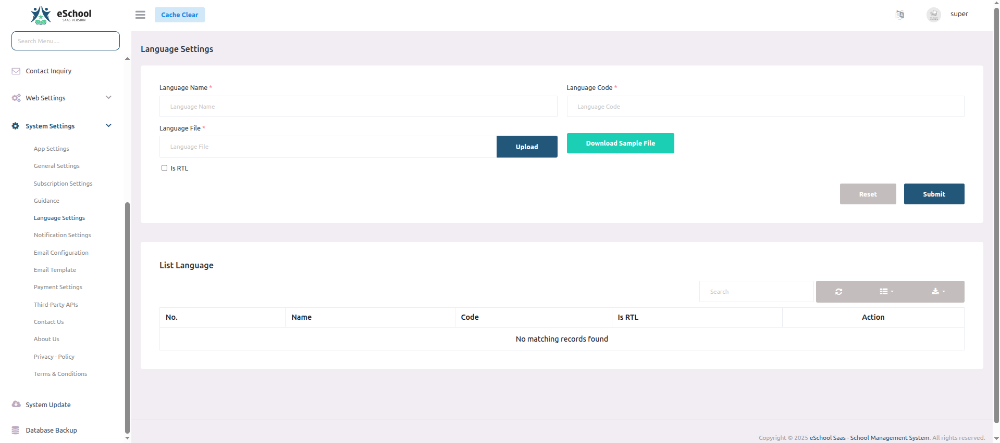

---

## 6️⃣ Notification Settings

### 🔥 Firebase Configuration
- **🆔 Firebase Project ID** – ID of your Firebase project
- **📄 Firebase Service File** – Upload `.json` file for Firebase integration

### 📋 Getting Firebase Credentials

**Step 1: Get Firebase Project ID**
1. Go to your Firebase Console
2. Select your project
3. The Project ID is shown in the project settings:

**Step 2: Download Service Account File**
1. In Firebase Console, go to Project Settings
2. Navigate to Service Accounts tab
3. Click "Generate New Private Key"
4. Save the downloaded `.json` file:

**Step 3: Upload Service Account File**
1. In admin panel, click "Upload Service File"
2. Select the downloaded `.json` file
3. Click "Save" to complete setup:

⚠️ **Important Notes:**
- Keep your service account file secure and never share it
- The file contains sensitive credentials
- Only upload official Firebase service account files

---

### 📧 Email Configuration

Configure your email settings to enable system notifications and communications.

#### 📨 Mailer Settings
- **📮 Mailer Type** - SMTP
- **🌐 Host** - smtp.gmail.com
- **🔌 Port** - 587
- **📧 Email** - mail.your-domain@gmail.com
- **🔑 Password** - •••••••••••••••••••
- **🔒 Encryption** - TLS
- **👤 Send From** - mail.your-domain@gmail.com

### 📨 Supported Email Providers
- **Mailgun** – Reliable email delivery service
- **Sendmail** – Traditional email sending
- **Postmark** – Transactional email service
- **Amazon SES** – Scalable email service

#### ✅ Email Configuration Verification
To verify your email settings are working correctly:

1. Enter a test email address (different from configuration email)
2. Click "Verify" button
3. Check inbox for test email
4. If received, configuration is successful

⚠️ **Note:** The verification email address must be different from the email used in the configuration settings.

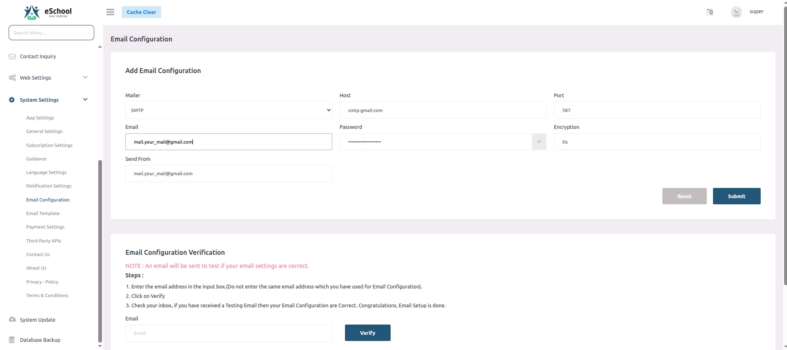

---

## 7️⃣ Email Templates

Configure email templates for different notification types:

### 📝 School Registration Template
Template for when a new school registers:
- **📋 Subject** - Welcome to **``{{school_name}}``**
- **📄 Body** - Customize welcome message and onboarding instructions
- **🔄 Variables** - Use **``{{school_name}}``**, **``{{email}}``**, **``{{password}}``** etc.

### School Application Rejection Template  
Template for rejected school applications:
- **📋 Subject** - Update on Your School Application
- **📄 Body** - Professional rejection message with feedback
- **🔄 Variables** - Use **``{{school_name}}``**, **``{{reason}}``**, etc.

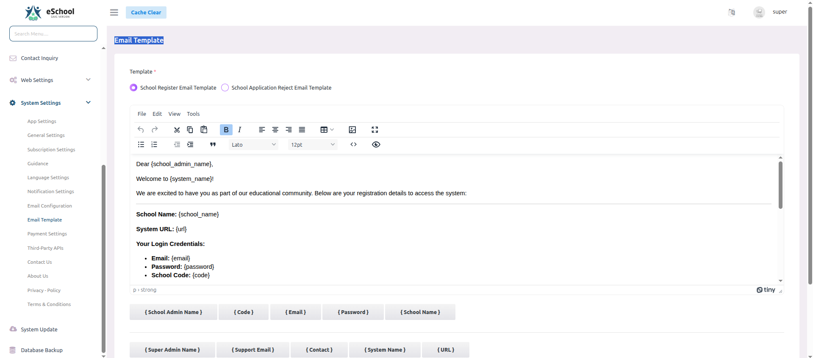

⚠️ **Important Tips:**
- Keep subject lines clear and concise
- Maintain professional tone in all communications
- Test templates before activating
- Include contact information for support
- Use variables consistently across templates

---

## 8️⃣ Payment Gateway Configuration

### 💰 Currency Settings
- **💵 Currency** – Default currency (USD, INR, etc.)
- **💲 Currency Symbol** – Symbol shown in invoices ($, ₹, etc.)

### 🏦 Payment Gateway Setup
Configure payment gateways for fee collection:

### 🔧 Gateway Configuration Parameters
Each gateway requires:
- **✅ Status** – Enable/Disable gateway
- **🔑 Publishable Key** – For client-side use
- **🔐 Secret Key** – For backend authorization
- **🔗 Webhook Secret** – Verifies webhook authenticity
- **📡 Webhook URL** – Receives payment notifications

### 💳 Supported Payment Gateways
- **💳 Stripe** – Global card-based payments
- **🇮🇳 Razorpay** – Popular in India
- **🌍 Paystack** – Ideal for West Africa
- **🦋 Flutterwave** – Wide African coverage, multi-currency

### 🔗 Webhook Configuration

**Stripe Webhook Setup:**

---

## 9️⃣ Security Settings

### 🛡️ Google reCAPTCHA (V2)
Protect your forms from spam and abuse:

- **🔑 RECAPTCHA SITE KEY** – Public browser key
- **🔐 RECAPTCHA SECRET KEY** – Server-side validation key

### 📚 Resources
- 🔗 [Manage reCAPTCHA Keys](https://www.google.com/recaptcha/admin/create)
- 🎥 [Setup Video Tutorial](https://drive.google.com/file/d/1sw2YJd-n8eJbm7R-IS5CUv_nx4bc5oDy/view)

---

## 🔟 Contact Us Settings

Configure your contact information and form settings to help users reach you:

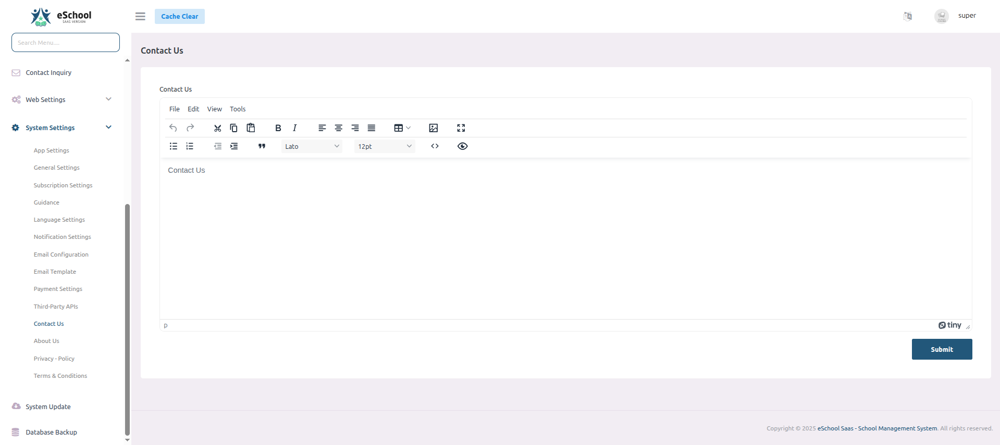

---

## 1️⃣1️⃣ About Us Settings

Configure your organization's information and branding that appears in the About Us section:

---

## 1️⃣2️⃣ Privacy Policy Settings

Configure privacy policies for different user groups in your system:

### 📜 System Privacy Policy
Set the main privacy policy that governs overall system usage:

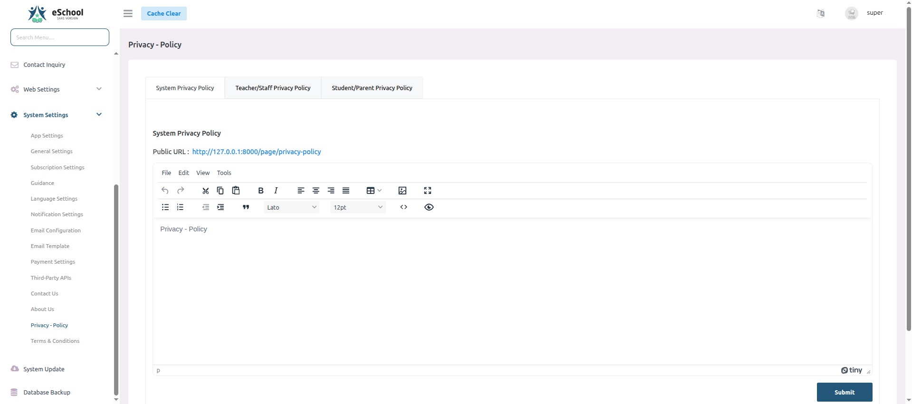

### 👨‍🏫 Teacher/Staff Privacy Policy 
Configure specific privacy terms for teaching and administrative staff:

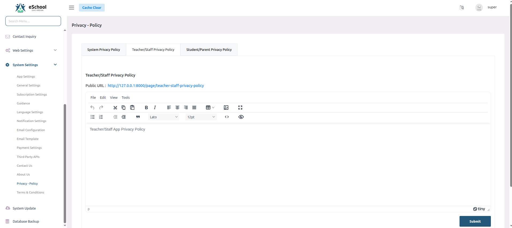

### 👨‍👩‍👧‍👦 Student/Parent Privacy Policy
Set privacy guidelines for students and their guardians:

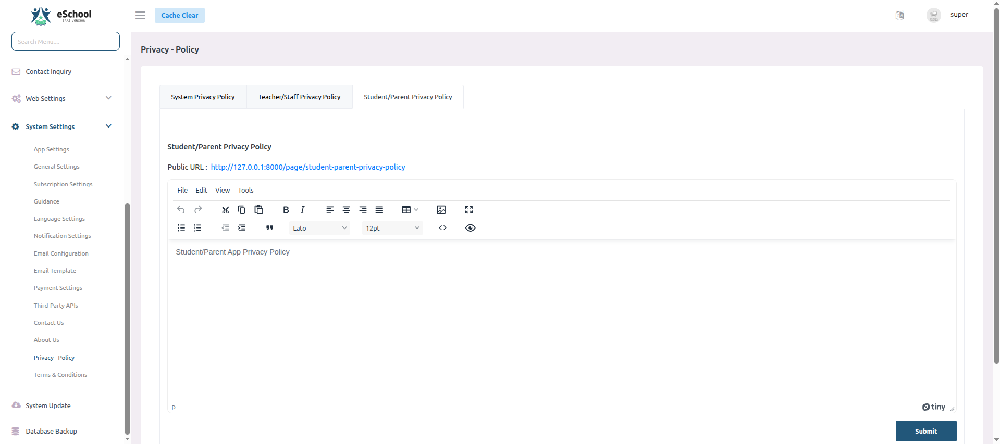

---

## 1️⃣3️⃣ Terms & Conditions Settings

Configure various terms & conditions for different user groups and scenarios:

### 📋 General Terms & Conditions
Set the main terms that govern overall system usage:

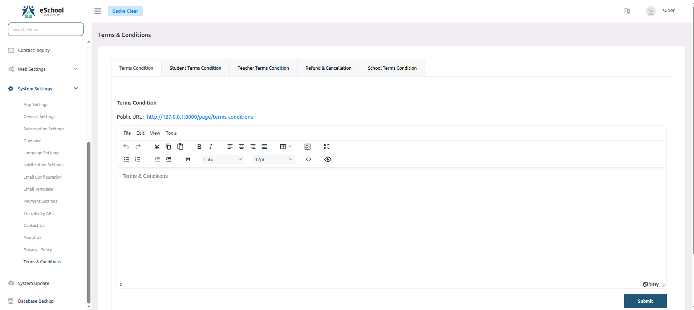

### 👨‍🎓 Student Terms & Conditions
Configure specific terms for student users:

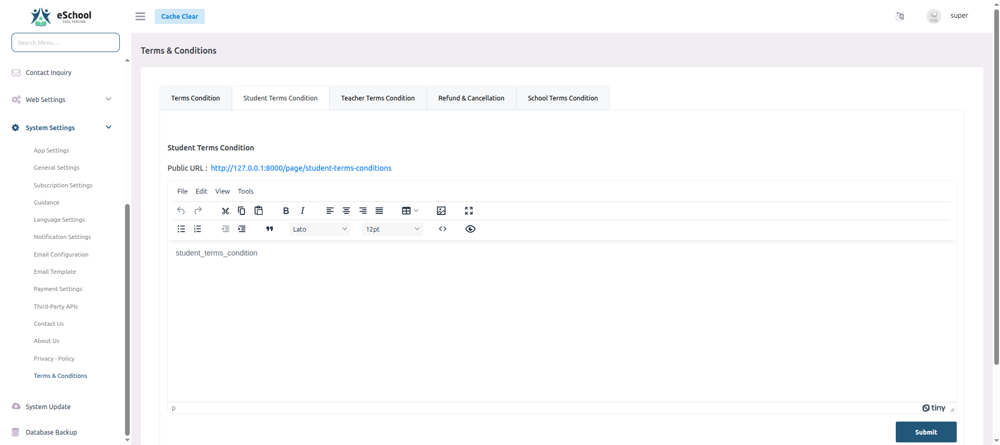

### 👨‍🏫 Teacher Terms & Conditions
Set terms of service for teaching staff:

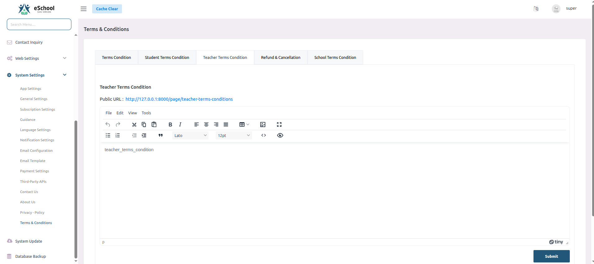

### 💰 Refund & Cancellation Policy
Configure refund and cancellation terms:

### 🏫 School Terms & Conditions
Set specific terms for school administration:

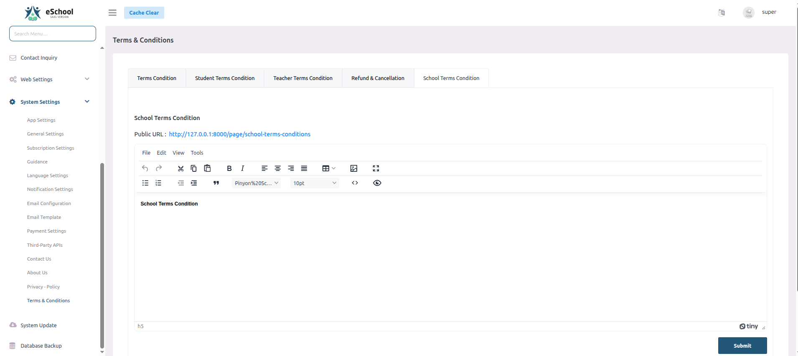

---

## 1️⃣4️⃣ System Updates

Keep your e-School SaaS installation up to date with the latest features and security patches.

### 📦 Update Process

1. Download the latest update package from Envato
2. Navigate to the System Updates section
3. Provide your purchase code and upload the update file:

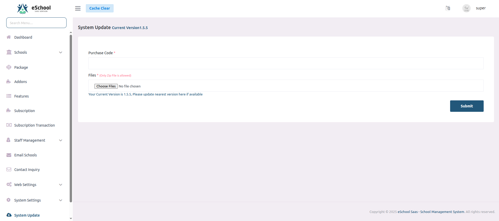

⚠️ **Important Notes:**
- Only super admin can access the database backup and update features
- Take a full database backup before updating
- Only upload the official update ZIP file from Envato marketplace
- Ensure your purchase code matches your installation
- Update to the nearest available version incrementally **(e.g. v1.0 -> v1.1 -> v1.2)** 
- Check system requirements before updating
- Clear cache and temporary files after update
- Test core functionality after each update
- Keep track of update history and changelog
- Contact support if you encounter any issues during update

---

## 1️⃣5️⃣ Database Backup Management

Maintain regular backups of your system data for disaster recovery and data protection.

### 📥 Generate Database Backup

1. Navigate to the Database Backup section in admin panel
2. Click on "Generate Backup" to create a new backup file:

### 📦 Download & Restore Backups

- Download generated backup files for safekeeping
- Upload and restore backups when needed:

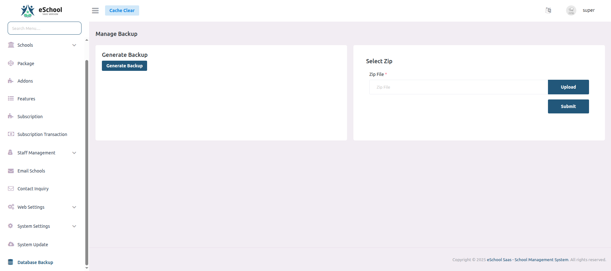

⚠️ **Important Notes:**
- Only super admin can manage database backups
- Store backup files securely offline
- Regularly schedule automated backups
- Test backup restoration periodically
- Keep multiple backup versions

---

## 🎉 Congratulations!

Your e-School SaaS system is now fully configured and ready to use! 🚀
