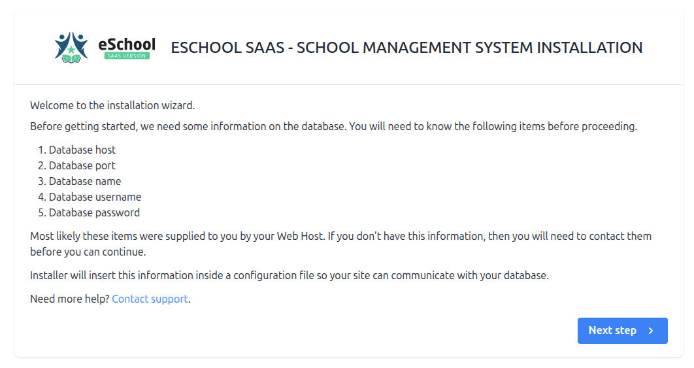
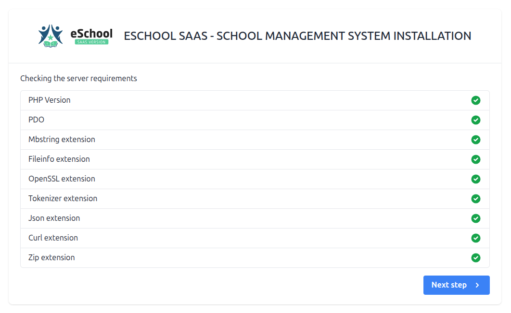
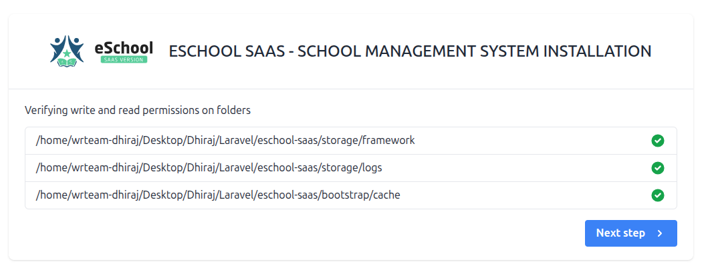
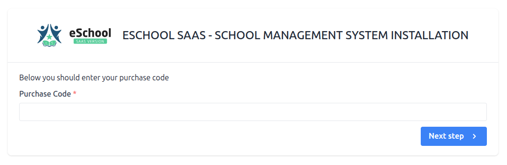
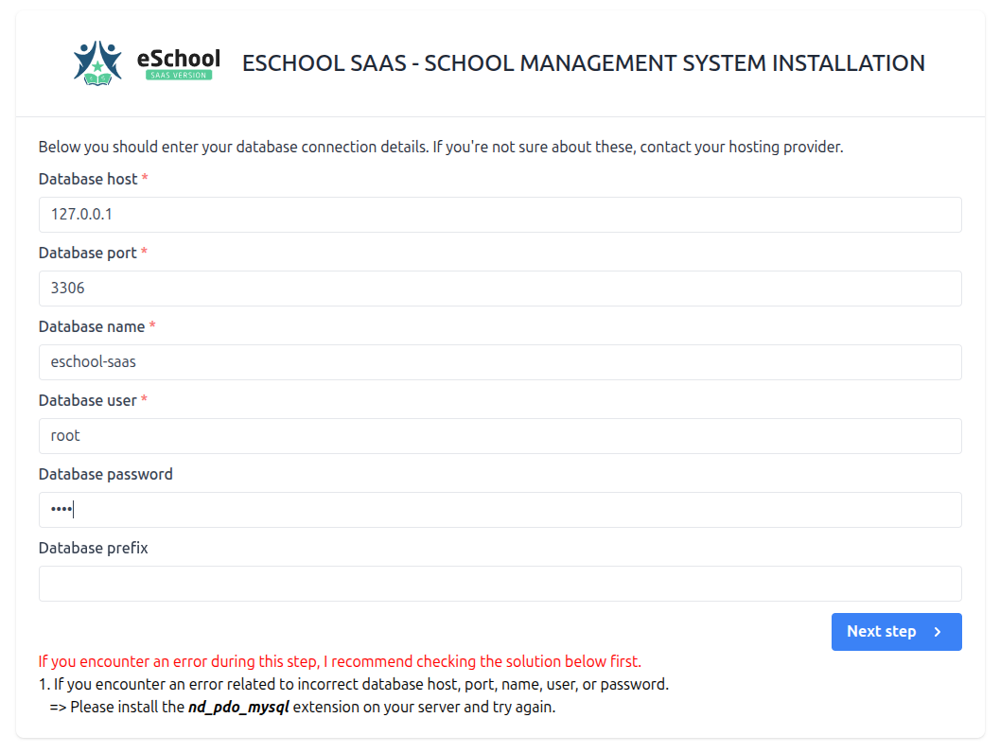
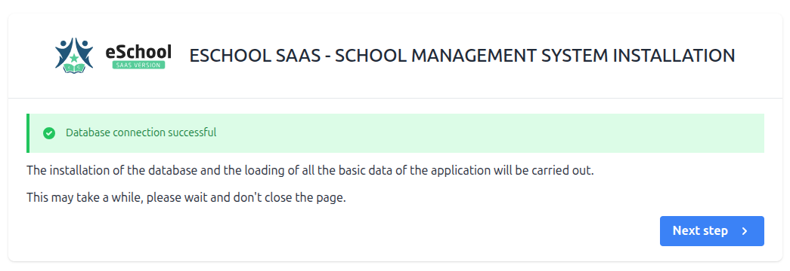
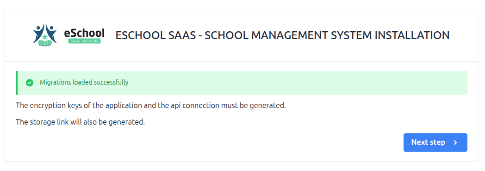
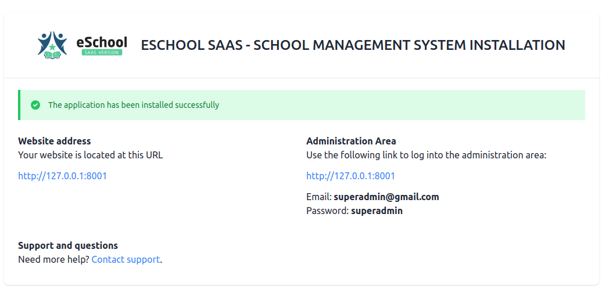

# 🚀 Installation Steps

## 📋 Overview
- Follow these step-by-step instructions to install e-School SaaS on your server.
- Ensure all server requirements are met before starting installation

## 🔄 Installation Process

### 1️⃣ Initial Installation Screen
The first screen you'll see when starting the installation process.

### 2️⃣ Server Requirements Check
⚠️ **Important:** If PHP version is lower than 8.0 or any extension is missing, it will be highlighted in red. Ensure your server meets all requirements before proceeding.

### 3️⃣ Directory Permissions
🔐 **Required Action:** Verify and set read & write permissions for these folders.

### 4️⃣ Purchase Code Verification
🔑 **Required:** Enter your purchase code to verify your license.

📝 **Finding Your Code:**
- Visit [Envato Help: Where is My Purchase Code?](https://help.market.envato.com/hc/en-us/articles/202822600-Where-Is-My-Purchase-Code-)
- Follow the instructions to locate your unique purchase code
- Copy and paste the code into the verification field

### 5️⃣ Database Setup
Configure your database connection settings.

📝 **Getting Database Credentials:**
- Follow our guide on [Database Access Setup](http://localhost:3000/eSchool-SaaS-Doc/installation/admin-panel-setup/vps-server-setup/#-database-access) to create and obtain your database credentials
- You'll need the following information:
  - Database Name
  - Database Username 
  - Database Password
  - Database Host (usually localhost)

    ### 6️⃣ Database Connection Status
Verify your database connection is successful.

### 7️⃣ Installation Complete
🎉 **Success!** Your Admin panel has been installed successfully. Use the provided credentials to log in as Super Admin.

### 8️⃣ Default Admin Panel Login Credentials
🔑 **Default Login Details:**
- Email: `superadmin@gmail.com`
- Password: `superadmin`

⚠️ **Important:** For security, please change these default credentials immediately after your first login.

## 📝 Notes
- Make sure to save your Super Admin credentials securely
- Keep your purchase code for future reference
