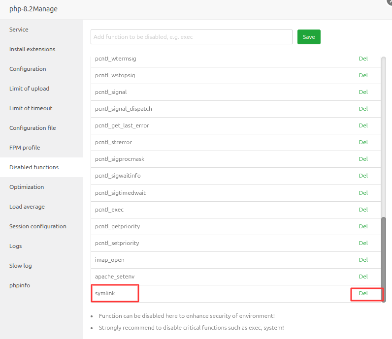

# VPS Server Setup

Before installing e-School SaaS, you need to properly configure your VPS server. Follow these detailed steps to set up your server environment.

## Initial Server Configuration

### 1. Server Requirements

- **Laravel Framework 10.0:** Ensure your server supports Laravel 10.0, which requires **PHP version 8.1.0 or higher** for optimal performance.
- **VPS Server for Multi-Tenancy Database:** A Virtual Private Server (VPS) is needed to handle multiple databases efficiently, with each school having a separate database.
- **KVM-2 VPS or Higher:** Recommended for better performance with dedicated resources.
- **Operating System:** Ubuntu latest version (clean installation, without control panels)
- **RAM:** Minimum 4GB (8GB recommended for better performance)
- **Storage:** 80GB SSD (expandable based on data storage needs)
- **CPU:** 2 vCores minimum (4 cores recommended)
- **Bandwidth:** At least 1TB monthly
- **Database Root User or Necessary Permissions:** Full root access or adequate privileges are required to create, modify, and delete databases dynamically as part of your multi-tenancy architecture.
- **Max Upload Size:** Set a high enough upload size limit (e.g., 50MB+) to allow for larger file uploads (Required only for updating new version).
- **Max Execution Time & Max Input Time:** Adjust the maximum execution time to avoid script timeouts during large operations like creating school databases, database imports, backups, or processing (recommended: 5000 seconds or more).
- **WebSocket Server:** Required for real-time chat functionality.
- **Ports and Firewall Configuration:** Ensure the necessary ports are open and properly configured in your server's firewall for WebSocket communication.

---

## Setup Option 1: Manual Server Configuration

### 1. Update System Packages

First, update your system packages to ensure you have the latest security updates and package versions:

```bash
sudo apt update
sudo apt upgrade -y
```

### 2. Install Essential Software

Install required tools and utilities:

```bash
sudo apt install -y curl wget unzip git software-properties-common
```

### 3. Install PHP 8.3 and Required Extensions

```bash
sudo add-apt-repository ppa:ondrej/php -y
sudo apt update
sudo apt install -y php8.3 php8.3-cli php8.3-common php8.3-fpm
sudo apt install -y php8.3-mysql php8.3-zip php8.3-gd php8.3-mbstring
sudo apt install -y php8.3-curl php8.3-xml php8.3-bcmath php8.3-intl
sudo apt install -y php8.3-imap php8.3-opcache php8.3-soap php8.3-redis
sudo apt install -y php8.3-fileinfo
```

### 4. Install Nginx Web Server

```bash
sudo apt install -y nginx
sudo systemctl enable nginx
sudo systemctl start nginx
```

### 5. Install MySQL Database Server

```bash
sudo apt install -y mysql-server
sudo systemctl enable mysql
sudo systemctl start mysql
```

Secure your MySQL installation:

```bash
sudo mysql_secure_installation
```

### 6. Configure MySQL for e-School SaaS

Create a database user with root privileges (required for multi-tenancy):

```bash
sudo mysql -u root -p
```

At the MySQL prompt, run:

```sql
CREATE USER 'eschool_admin'@'localhost' IDENTIFIED BY 'strong_password';
GRANT ALL PRIVILEGES ON *.* TO 'eschool_admin'@'localhost' WITH GRANT OPTION;
FLUSH PRIVILEGES;
EXIT;
```

### 7. Configure PHP Settings

Edit the PHP configuration file to optimize it for e-School SaaS:

```bash
sudo nano /etc/php/8.3/fpm/php.ini
```

Find and modify these settings:

```ini
memory_limit = 256M
upload_max_filesize = 50M
post_max_size = 50M
max_execution_time = 5000
max_input_time = 5000
max_file_uploads = 50
```

Save the file and restart PHP-FPM:

```bash
sudo systemctl restart php8.3-fpm
```

### 8. Configure Nginx for e-School SaaS

Create a new Nginx server block configuration:

```bash
sudo nano /etc/nginx/sites-available/eschool
```

Add the following configuration (replace `yourdomain.com` with your domain):

```nginx
server {
    listen 80;
    server_name yourdomain.com *.yourdomain.com;
    root /var/www/html/public;

    add_header X-Frame-Options "SAMEORIGIN";
    add_header X-Content-Type-Options "nosniff";

    index index.php index.html;
    charset utf-8;

    location / {
        try_files $uri $uri/ /index.php?$query_string;
    }

    location = /favicon.ico { access_log off; log_not_found off; }
    location = /robots.txt  { access_log off; log_not_found off; }

    error_page 404 /index.php;

    location ~ \.php$ {
        fastcgi_pass unix:/var/run/php/php8.3-fpm.sock;
        fastcgi_param SCRIPT_FILENAME $realpath_root$fastcgi_script_name;
        include fastcgi_params;
    }

    location ~ /\.(?!well-known).* {
        deny all;
    }
}
```

Enable the configuration and restart Nginx:

```bash
sudo ln -s /etc/nginx/sites-available/eschool /etc/nginx/sites-enabled/
sudo nginx -t
sudo systemctl restart nginx
```

### 9. Install SSL Certificate (Recommended)

Install Certbot for free SSL certificates:

```bash
sudo apt install -y certbot python3-certbot-nginx
sudo certbot --nginx -d yourdomain.com -d *.yourdomain.com
```

### 10. Set Up WebSocket Server for Chat

Install Supervisor to manage the WebSocket process:

```bash
sudo apt install -y supervisor
```

Create a configuration file for the WebSocket server:

```bash
sudo nano /etc/supervisor/conf.d/websocket.conf
```

Add the following configuration (replace `/your_root_folder_path/` with your actual path):

```ini
[program:websocket]
process_name=websocket
command=/usr/bin/php /your_root_folder_path/artisan websocket:init
autostart=true
autorestart=true
user=www-data
redirect_stderr=true
stdout_logfile=/your_root_folder_path/storage/logs/websocket.log
stderr_logfile=/your_root_folder_path/storage/logs/websocket.log
```

Reload and update Supervisor configuration:

```bash
sudo supervisorctl reread
sudo supervisorctl update
sudo supervisorctl status
```

### 11. Configure Firewall

Install and configure UFW (Uncomplicated Firewall):

```bash
sudo apt install -y ufw
sudo ufw allow 22/tcp
sudo ufw allow 80/tcp
sudo ufw allow 443/tcp
sudo ufw allow 8090/tcp  # For WebSocket Server
sudo ufw enable
```

### 12. Create Web Directory

Create the web directory and set proper permissions:

```bash
sudo mkdir -p /var/www/html
sudo chown -R www-data:www-data /var/www/html
sudo chmod -R 755 /var/www/html
```

---

## Setup Option 2: Using aaPanel (Recommended)

aaPanel is a lightweight and powerful server management tool that makes it easier to configure and manage your server for e-School SaaS.

### 1. Install aaPanel

First, login to your server terminal using SSH:

```bash
ssh root@your-server-ip
```

Once logged in, run the following command to download and install aaPanel:

```bash
URL=https://www.aapanel.com/script/install_7.0_en.sh && if [ -f /usr/bin/curl ];then curl -ksSO "$URL" ;else wget --no-check-certificate -O install_7.0_en.sh "$URL";fi;bash install_7.0_en.sh aapanel
```

After installation completes, you'll receive the aaPanel credentials including URL, username, and password. Save these details for login.

### 2. Install Required Software via aaPanel

Log in to aaPanel using the provided URL and credentials, then install:

- Web server (Nginx or Apache recommended)
- MySQL
- PHP 8.3
- phpMyAdmin


### 3. Configure PHP Extensions and Settings

In aaPanel, navigate to PHP Settings and install these extensions:

- fileinfo
- mbstring


Then go to PHP Configuration and set these values:

- max_execution_time = 5000
- max_input_time = 5000
- post_max_size = 50M
- upload_max_filesize = 50M
- max_file_uploads = 50



Go to PHP Disabled Functions and remove `symlink` from the list.

Restart PHP services after making these changes.


### 4. Add Website in aaPanel

Go to the Websites section and click on Add Site:

- Enter your domain name
- Select MySQL for the database section
- Select PHP 8.3
- Submit to create the website


### 5. Add Wildcard Domain

After adding the main domain, go to the domain configuration and add a wildcard domain with the format: `*.your_domain_name`


### 6. Configure DNS

Add DNS A records for your domain:

- Type: A
- Name : * (`*.domain.com`)
- Name : *.subdomain (`*.subdomain.domain.com`)
- Point To : Your server IP

### 7. Add SSL Certificate

Add SSL certificates for both your main domain and wildcard domain using Let's Encrypt DNS verification.


### 8. Upload Source Code

Upload your source code to the domain directory and ensure the web path points to the public directory.


### 9. Get MySQL Root Credentials

To get MySQL root credentials, run this command in the terminal:

```bash
sudo cat /root/.my.cnf
```


### 10. Set Up WebSocket

Install Supervisor:

```bash
sudo apt update
sudo apt install supervisor
```

Create a configuration file for the WebSocket server:

```bash
sudo nano /etc/supervisor/conf.d/websocket.conf
```

Add the following content (replace `/your_root_folder_path/` with your actual path):

```ini
[program:websocket]
process_name=websocket
command=/usr/bin/php /your_root_folder_path/artisan websocket:init
autostart=true
autorestart=true
user=www-data
redirect_stderr=true
stdout_logfile=/your_root_folder_path/storage/logs/websocket.log
stderr_logfile=/your_root_folder_path/storage/logs/websocket.log
```

Update Supervisor:

```bash
sudo supervisorctl reread
sudo supervisorctl update
sudo supervisorctl status
```

Enable port 8090 in your firewall for WebSocket communication. Your WebSocket URL will be:

```
ws://your_server_ip:8090
```

Now your server is ready for the e-School SaaS installation. Proceed to the next section to install the application.
