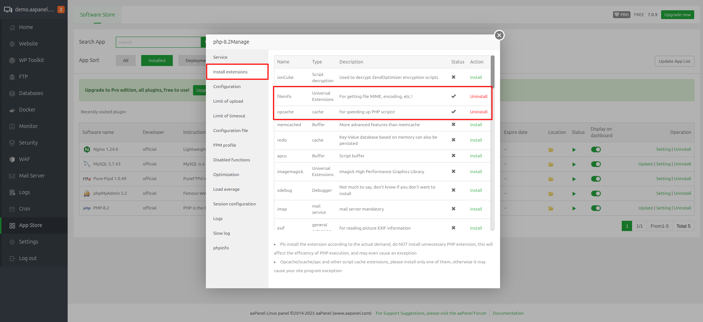

# 🚀 VPS Server Setup

Before installing e-School SaaS, you need to properly configure your VPS server. Follow these detailed steps to set up your server environment.

## 🔧 Initial Server Configuration

### 📋 Server Requirements

| Component | Minimum | Recommended |
|-----------|---------|-------------|
| **RAM** | 4GB | 8GB |
| **Storage** | 80GB SSD | Expandable |
| **CPU** | 2 vCores | 4 vCores |
| **Bandwidth** | 1TB monthly | - |
| **PHP Version** | 8.1.0+ | 8.3+ |
| **Laravel Version** | 10.0 | Latest |

### ⚙️ Technical Requirements

- **Operating System:** Ubuntu latest version (clean installation, without control panels)
- **VPS Type:** KVM-2 VPS or Higher (recommended for better performance)
- **Database Access:** Root user or necessary permissions for multi-tenancy
- **File Upload Limits:**
  - Max Upload Size: 50MB+
  - Max Execution Time: 5000 seconds
  - Max Input Time: 5000 seconds
- **WebSocket Server:** Required for real-time chat functionality
- **Port Configuration:** Properly configured firewall for WebSocket communication

---

## 🎛️ Control Panel Options

We recommend using one of the following control panels for easier server management:

### Option 1: aaPanel
[](https://www.aapanel.com/)

### Option 2: CloudPanel
[](https://www.cloudpanel.io/)

## 🛠️ Setup Option 1: Using aaPanel (Recommended)

aaPanel is a lightweight and powerful server management tool that makes it easier to configure and manage your server for e-School SaaS.

### 1️⃣ Install aaPanel

First, login to your server terminal using SSH:

```bash
ssh root@your-server-ip
```

Once logged in, run the following command to download and install aaPanel:

```bash
URL=https://www.aapanel.com/script/install_7.0_en.sh && if [ -f /usr/bin/curl ];then curl -ksSO "$URL" ;else wget --no-check-certificate -O install_7.0_en.sh "$URL";fi;bash install_7.0_en.sh aapanel
```

> 💡 **Note:** After installation completes, you'll receive the aaPanel credentials including URL, username, and password. Save these details for login.

### 2️⃣ Install Required Software via aaPanel

Log in to aaPanel using the provided URL and credentials, then install:

- 🌐 Web server (Nginx or Apache recommended)
- 🗄️ MySQL
- 🐘 PHP 8.3
- 📊 phpMyAdmin


### 3️⃣ Configure PHP Extensions and Settings

#### Required PHP Extensions:
- 📁 fileinfo
- 🔤 mbstring



#### PHP Configuration Values:
| Setting | Value |
|---------|-------|
| max_execution_time | 5000 |
| max_input_time | 5000 |
| post_max_size | 50M |
| upload_max_filesize | 50M |
| max_file_uploads | 50 |


> ⚠️ **Important:** Go to PHP Disabled Functions and remove `symlink` from the list.

Restart PHP services after making these changes.


### 4️⃣ Add Website in aaPanel

Go to the Websites section and click on Add Site:

1. Enter your domain name
2. Select MySQL for the database section
3. Select PHP 8.3
4. Submit to create the website


### 5️⃣ Add Wildcard Domain

After adding the main domain, go to the domain configuration and add a wildcard domain with the format: `*.your_domain_name`


### 6️⃣ Configure DNS

Add DNS A records for your domain:

| Type | Name | Point To |
|------|------|-----------|
| A | * (`*.domain.com`) | Your server IP |
| A | *.subdomain (`*.subdomain.domain.com`) | Your server IP |

### 7️⃣ Add SSL Certificate

Add SSL certificates for both your main domain and wildcard domain using Let's Encrypt DNS verification.


### 8️⃣ Upload Source Code

Upload your source code to the domain directory and ensure the web path points to the public directory.


### 9️⃣ Get MySQL Root Credentials

To get MySQL root credentials, run this command in the terminal:

```bash
sudo cat /root/.my.cnf
```


### 🔟 Set Up WebSocket

#### Install Supervisor:
```bash
sudo apt update
sudo apt install supervisor
```

#### Create WebSocket Configuration:
```bash
sudo nano /etc/supervisor/conf.d/websocket.conf
```

Add the following content (replace `/your_root_folder_path/` with your actual path):

```ini
[program:websocket]
process_name=websocket
command=/usr/bin/php /your_root_folder_path/artisan websocket:init
autostart=true
autorestart=true
user=www-data
redirect_stderr=true
stdout_logfile=/your_root_folder_path/storage/logs/websocket.log
stderr_logfile=/your_root_folder_path/storage/logs/websocket.log
```

#### Update Supervisor:
```bash
sudo supervisorctl reread
sudo supervisorctl update
sudo supervisorctl status
```

> 🔒 **Security Note:** Enable port 8090 in your firewall for WebSocket communication.

Your WebSocket URL will be:
```
ws://your_server_ip:8090
```

---

> 🎉 **Congratulations!** Your server is now ready for the e-School SaaS installation. Proceed to the next section to install the application.
